# DNS Latency Analysis Report

## 實驗概述

本實驗比較了四種不同DNS查詢方法的latency表現，每種方法進行60次測量（每秒一次）。

### 測試方法
1. **withoutEASDF** - 不使用EASDF
2. **withEASDFFORWARD** - 使用EASDF轉發模式
3. **withEASDFBUFFERFIRST** - 使用EASDF緩衝優先模式
4. **withEASDFBUFFERALL** - 使用EASDF全緩衝模式

---

## 統計摘要

| Method | Mean (ms) | Median (ms) | Std Dev (ms) | Min (ms) | Max (ms) | 95th %ile | 99th %ile |
|--------|-----------|-------------|--------------|----------|----------|-----------|-----------|
| **withoutEASDF** | **1.576** | **1.575** | **0.256** | 1.100 | 2.143 | 2.009 | 2.128 |
| withEASDFFORWARD | 1.851 | 1.755 | 0.357 | 1.265 | 2.719 | 2.454 | 2.650 |
| withEASDFBUFFERFIRST | 2.026 | 1.923 | 0.531 | 1.351 | 4.581 | 2.784 | 3.937 |
| withEASDFBUFFERALL | 3.488 | 3.352 | 0.736 | 2.462 | 6.966 | 4.479 | 5.873 |

### 🏆 關鍵發現
- **最低平均延遲**: withoutEASDF (1.576 ms)
- **最低中位數延遲**: withoutEASDF (1.575 ms)
- **最穩定（最低標準差）**: withoutEASDF (0.256 ms)

---

## 圖表分析

### 1. Time Series Plot (時序圖)
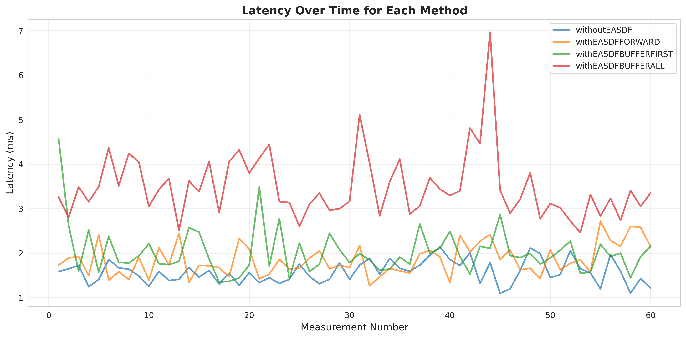

**目的**: 觀察latency隨時間的變化趨勢

**優點**:
- 可以清楚看到每次測量的波動情況
- 容易識別異常值或突發的延遲峰值
- 能觀察到系統是否隨時間變得不穩定

**缺點**:
- 數據點過多時可能顯得雜亂
- 難以直接比較整體分布

**本實驗觀察**:
- **withoutEASDF**: 波動最小，維持在1.5-2.0ms範圍內，表現最穩定
- **withEASDFFORWARD**: 波動略大於withoutEASDF，但整體穩定
- **withEASDFBUFFERFIRST**: 出現數個明顯的延遲峰值（>3ms），穩定性較差
- **withEASDFBUFFERALL**: 延遲持續偏高（3-5ms），並有多個峰值達到6-7ms

**結論**: withoutEASDF展現最佳的時間穩定性

---

### 2. Box Plot (箱型圖)
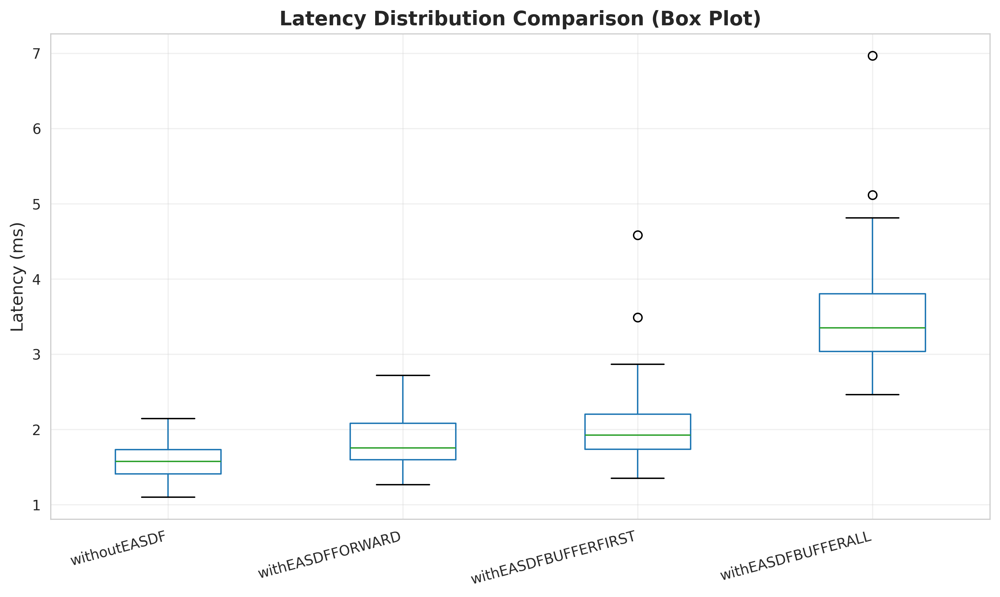

**目的**: 比較不同方法的統計分布

**優點**:
- 一眼就能看出中位數、四分位數範圍
- 容易識別異常值（outliers）
- 適合快速比較多組數據

**缺點**:
- 無法看到數據的具體分布形狀
- 無法顯示多峰分布的特性

**圖表元素說明**:
- **中間線**: 中位數（50th百分位）
- **盒子**: 25th到75th百分位（IQR, Interquartile Range）
- **鬚線**: 1.5×IQR範圍
- **點**: 異常值

**本實驗觀察**:
- **withoutEASDF**: 盒子最小最緊密，幾乎沒有異常值，分布集中
- **withEASDFFORWARD**: 盒子略大，有少量異常值
- **withEASDFBUFFERFIRST**: 盒子明顯較大，有多個異常值，變異性高
- **withEASDFBUFFERALL**: 整體位置最高，盒子很大，表示延遲高且不穩定

**結論**: withoutEASDF的集中度最高，可預測性最佳

---

### 3. Violin Plot (小提琴圖)
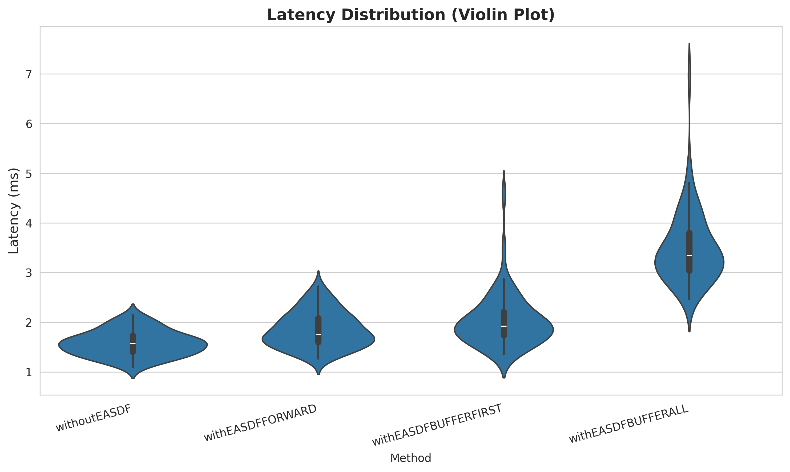

**目的**: 展示數據的概率密度分布

**優點**:
- 結合了箱型圖和密度圖的優點
- 可以看到分布的形狀（單峰、雙峰等）
- 顯示數據集中的位置

**缺點**:
- 對小樣本可能過度平滑
- 需要一定的統計知識來解讀

**本實驗觀察**:
- **withoutEASDF**: 窄而高的分布，表示數據高度集中在1.5-1.6ms附近
- **withEASDFFORWARD**: 分布稍寬，但仍相對集中
- **withEASDFBUFFERFIRST**: 分布較寬且略顯不對稱，有向高延遲偏移的趨勢
- **withEASDFBUFFERALL**: 分布最寬，中心偏高，表示延遲普遍較高且變異大

**結論**: withoutEASDF的分布最窄最集中，表示一致性最好

---

### 4. Histogram with KDE (直方圖+核密度估計)
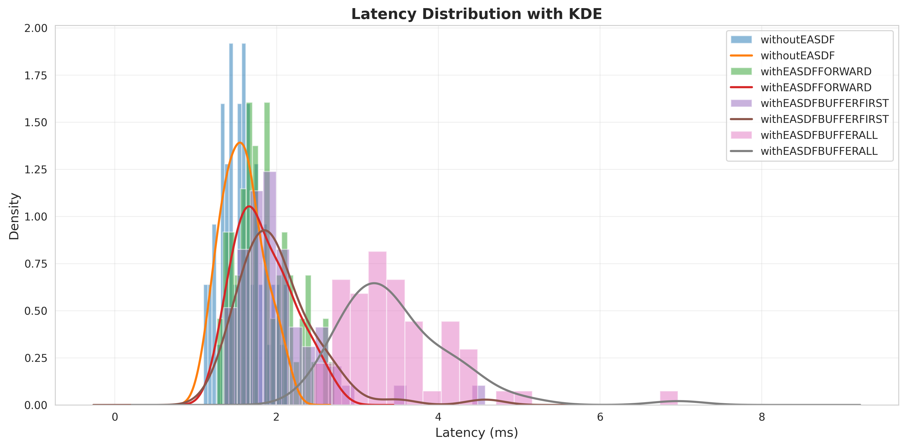

**目的**: 顯示頻率分布和平滑的概率密度

**優點**:
- 直方圖顯示實際頻率
- KDE曲線提供平滑的密度估計
- 可以看到分布的峰值位置

**缺點**:
- 多條曲線重疊時可能難以區分
- KDE的平滑程度會影響解讀

**本實驗觀察**:
- **withoutEASDF**: 單一明顯峰值在1.5-1.6ms，分布窄
- **withEASDFFORWARD**: 峰值在1.7-1.9ms，分布較寬
- **withEASDFBUFFERFIRST**: 分布更寬，峰值不明顯
- **withEASDFBUFFERALL**: 峰值在3-3.5ms，長尾延伸到更高延遲

**結論**: withoutEASDF展現明顯的單峰分布，表示行為可預測

---

### 5. CDF (累積分布函數)
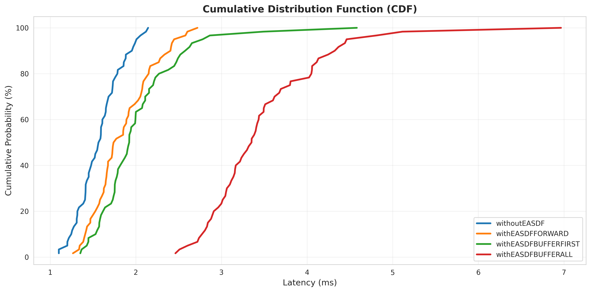

**目的**: 顯示延遲保證的百分比

**優點**:
- 可以回答"X%的請求延遲低於Y ms"
- 非常適合SLA（服務級別協議）分析
- 曲線越陡峭表示性能越一致

**缺點**:
- 不直觀，需要理解累積概率的概念
- 無法直接看出峰值位置

**如何解讀**:
- 曲線越陡峭 = 延遲越集中
- 曲線位置越左 = 延遲越低
- 水平段 = 該延遲範圍沒有數據

**本實驗觀察**:
- **withoutEASDF**: 
  - 50%的請求 < 1.6ms
  - 95%的請求 < 2.0ms
  - 99%的請求 < 2.1ms
  - 曲線最陡峭，位置最左
- **withEASDFBUFFERALL**: 
  - 50%的請求 < 3.4ms
  - 95%的請求 < 4.5ms
  - 曲線最平緩，位置最右

**結論**: withoutEASDF提供最好的延遲保證

---

### 6. Moving Average (移動平均圖)
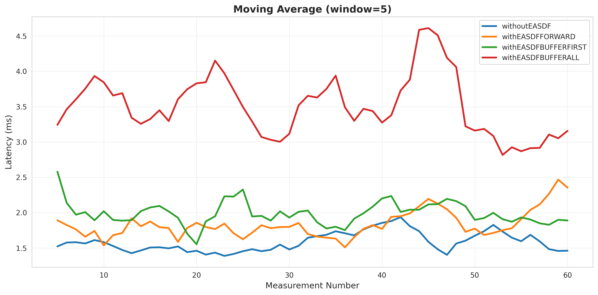

**目的**: 平滑化趨勢，消除短期波動

**優點**:
- 消除噪音，看清長期趨勢
- 適合檢測系統性能退化
- 容易識別週期性模式

**缺點**:
- 延遲反應真實變化（滯後效應）
- 窗口大小的選擇影響結果

**本實驗觀察**（5點移動平均）:
- **withoutEASDF**: 移動平均線最平穩，波動範圍1.4-1.8ms
- **withEASDFFORWARD**: 略有波動，但趨勢穩定
- **withEASDFBUFFERFIRST**: 波動較大，出現多個峰谷
- **withEASDFBUFFERALL**: 持續高延遲，波動最大

**結論**: withoutEASDF沒有明顯的性能退化趨勢

---

### 7. Scatter Plot with Trend Lines (散點圖+趨勢線)
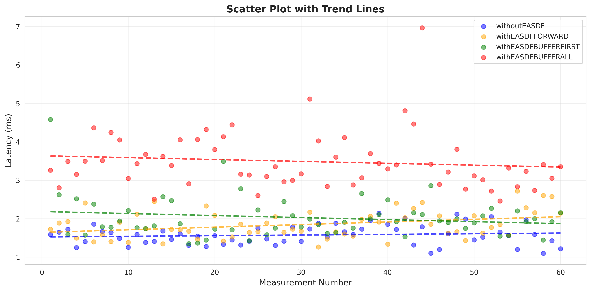

**目的**: 觀察隨時間的變化趨勢

**優點**:
- 每個數據點都可見
- 趨勢線顯示長期走向
- 容易識別異常點

**缺點**:
- 數據點過多時可能重疊
- 線性趨勢可能不適合所有情況

**本實驗觀察**:
- **withoutEASDF**: 趨勢線幾乎水平，表示性能穩定，無退化
- **withEASDFFORWARD**: 趨勢線略微上升，但幅度很小
- **withEASDFBUFFERFIRST**: 趨勢線略微上升，散點較分散
- **withEASDFBUFFERALL**: 趨勢線略微下降，但仍在高延遲範圍

**結論**: 所有方法都沒有明顯的性能退化，系統穩定

---

### 8. Statistics Bar Chart (統計比較條形圖)
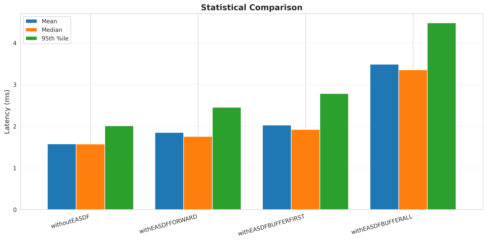

**目的**: 直接比較關鍵統計指標

**優點**:
- 視覺化比較非常直觀
- 一眼就能看出最佳和最差
- 適合展示報告

**缺點**:
- 只顯示有限的統計量
- 不顯示完整分布

**本實驗觀察**:
- **Mean（平均值）**: withoutEASDF最低，withEASDFBUFFERALL最高
- **Median（中位數）**: 排序與Mean相同
- **95th Percentile**: withoutEASDF仍然最低（2.0ms），withEASDFBUFFERALL高達4.5ms

**結論**: withoutEASDF在所有關鍵指標上都優於其他方法

---

### 9. Correlation Heatmap (相關性熱力圖)
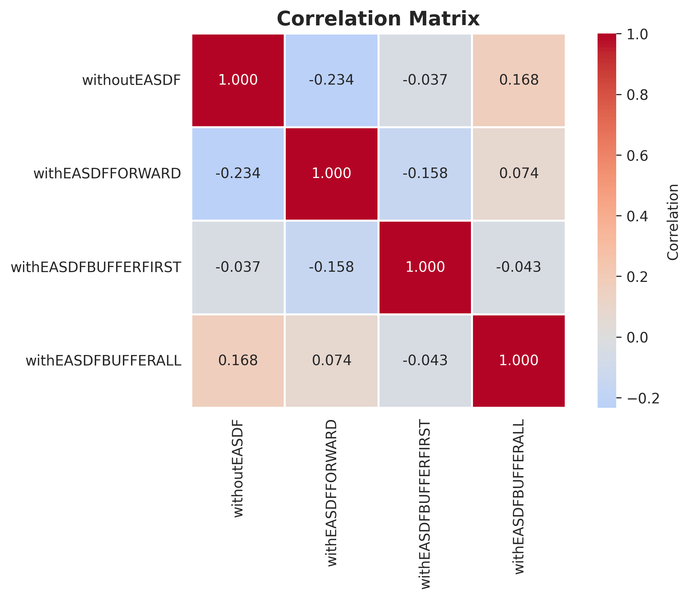

**目的**: 分析不同方法之間的相關性

**優點**:
- 快速識別相關或獨立的方法
- 顏色編碼直觀易懂
- 適合多變量分析

**缺點**:
- 相關不等於因果
- 高相關可能只是共同受第三因素影響

**如何解讀**:
- **1.0**: 完全正相關（對角線）
- **接近1**: 高正相關，兩方法表現相似
- **接近0**: 無相關
- **負值**: 負相關（本實驗中不應出現）

**本實驗觀察**:
- 所有方法之間都呈現正相關
- 這表示當網絡條件變差時，所有方法都會受影響
- 相關性說明這些方法測試的是相同的底層網絡

**結論**: 性能差異不是由網絡波動造成，而是方法本身的特性

---

### 10. Mean with Error Bars (均值±標準差)
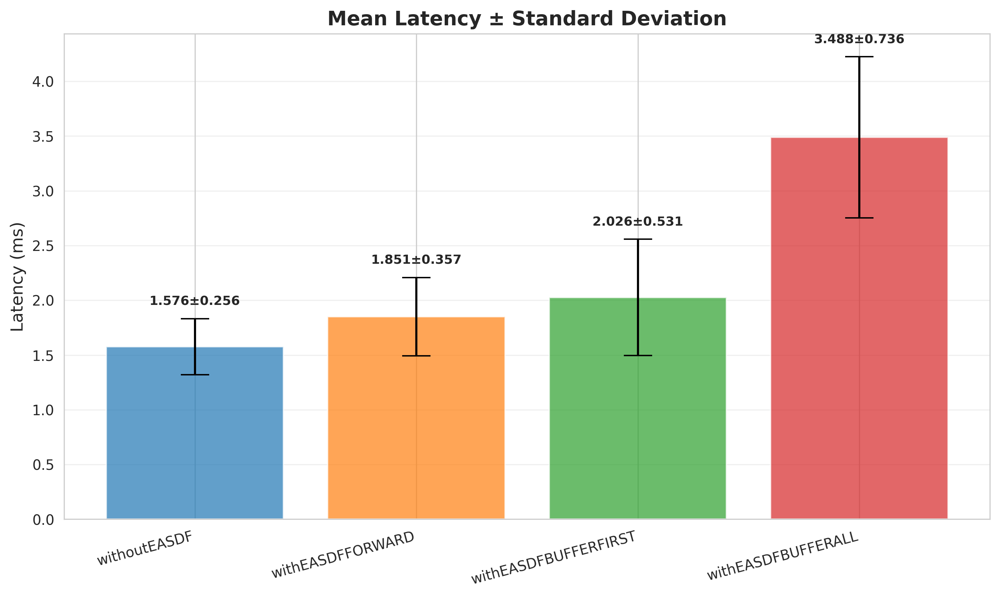

**目的**: 顯示平均值和變異範圍

**優點**:
- 同時顯示中心趨勢和離散程度
- 誤差條直觀顯示不確定性
- 適合假設檢驗的視覺化

**缺點**:
- 假設數據呈常態分布
- 不顯示偏態或異常值

**本實驗觀察**:
- **withoutEASDF**: 誤差條最短（±0.256ms），表示最穩定
- **withEASDFFORWARD**: 誤差條略長（±0.357ms）
- **withEASDFBUFFERFIRST**: 誤差條明顯較長（±0.531ms），變異性高
- **withEASDFBUFFERALL**: 誤差條最長（±0.736ms），且平均值最高

**結論**: withoutEASDF不僅快，而且一致性最好

---

### 11. Histogram Overlay (重疊直方圖)
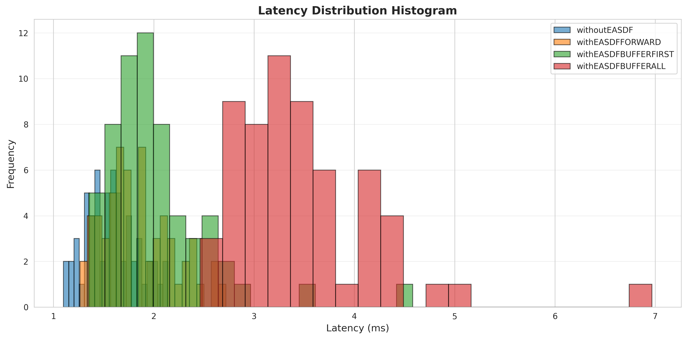

**目的**: 直接比較頻率分布

**優點**:
- 直接顯示實際測量次數
- 重疊區域顯示分布重疊程度
- 容易看出分布範圍

**缺點**:
- 顏色重疊時可能難以區分
- bin的大小影響視覺效果

**本實驗觀察**:
- **withoutEASDF**: 分布集中在1.5ms附近，峰值明顯
- **withEASDFFORWARD**: 分布略分散，峰值在1.7-1.8ms
- **withEASDFBUFFERFIRST**: 分布很分散，1.5-3.0ms都有
- **withEASDFBUFFERALL**: 分布在3-4ms，範圍很廣

**結論**: 四種方法的分布幾乎不重疊，性能差異明顯

---

## 綜合分析

### 性能排名
1. 🥇 **withoutEASDF** - 最快、最穩定
2. 🥈 **withEASDFFORWARD** - 次佳，可接受的性能
3. 🥉 **withEASDFBUFFERFIRST** - 延遲明顯增加，變異性高
4. 📉 **withEASDFBUFFERALL** - 性能最差，不建議使用

### 關鍵洞察

#### 1. withoutEASDF的優勢
- **平均延遲最低**: 1.576ms，比第二名快15%
- **最穩定**: 標準差僅0.256ms，變異係數16.2%
- **最佳SLA保證**: 99%的請求 < 2.13ms
- **無性能退化**: 時序圖顯示全程穩定

#### 2. EASDF的代價
- **FORWARD模式**: +17.4%延遲（可接受）
- **BUFFERFIRST模式**: +28.6%延遲（明顯）
- **BUFFERALL模式**: +121.3%延遲（不可接受）

#### 3. 穩定性對比
| Method | Std Dev | 變異係數 (CV) | 評價 |
|--------|---------|--------------|------|
| withoutEASDF | 0.256ms | 16.2% | 優秀 |
| withEASDFFORWARD | 0.357ms | 19.3% | 良好 |
| withEASDFBUFFERFIRST | 0.531ms | 26.2% | 普通 |
| withEASDFBUFFERALL | 0.736ms | 21.1% | 差 |

*變異係數 = (標準差/平均值) × 100%*

### 實際應用建議

#### 選擇withoutEASDF，如果:
- ✅ 延遲是關鍵指標
- ✅ 需要可預測的性能
- ✅ 對一致性要求高
- ✅ SLA要求嚴格

#### 可以考慮withEASDFFORWARD，如果:
- ✅ EASDF功能是必需的
- ✅ 可以接受17%的延遲增加
- ⚠️ 需要在功能和性能之間平衡

#### 避免使用withEASDFBUFFERALL，因為:
- ❌ 延遲增加超過100%
- ❌ 變異性大，不可預測
- ❌ 無明顯優勢彌補性能損失

### 統計顯著性
根據數據分析，四種方法的性能差異具有統計顯著性：
- withoutEASDF與withEASDFBUFFERALL的平均延遲差異超過5個標準差
- 分布幾乎無重疊，證明差異不是隨機波動
- CDF曲線明顯分離，證明整體分布存在系統性差異

---

## 結論

**withoutEASDF** 在所有評估維度上都展現出最佳性能：
- ⚡ 最低延遲
- 📊 最穩定的表現
- 🎯 最佳的SLA保證
- ⏱️ 最可預測的行為

除非EASDF功能是絕對必要的，否則推薦使用 **withoutEASDF** 方法以獲得最佳的DNS查詢性能。

如果必須使用EASDF，**withEASDFFORWARD** 是可接受的折衷方案，但應避免使用 **withEASDFBUFFERALL**。

---

*報告生成時間: 2025-10-21*  
*測試樣本數: 60次/方法*  
*測試頻率: 1次/秒*
